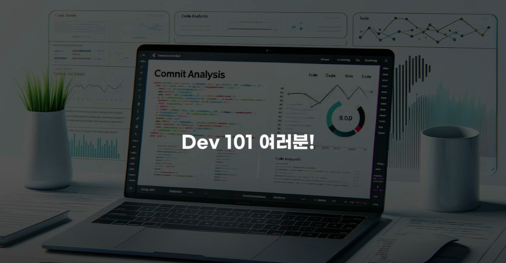
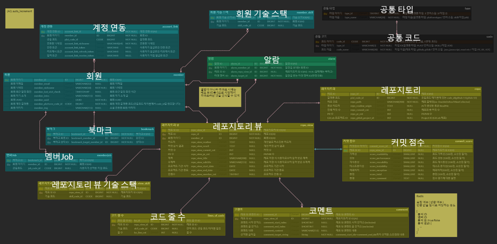
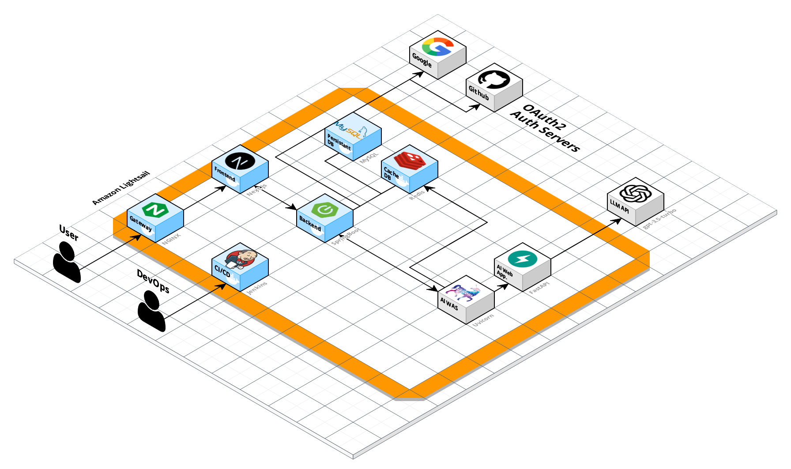
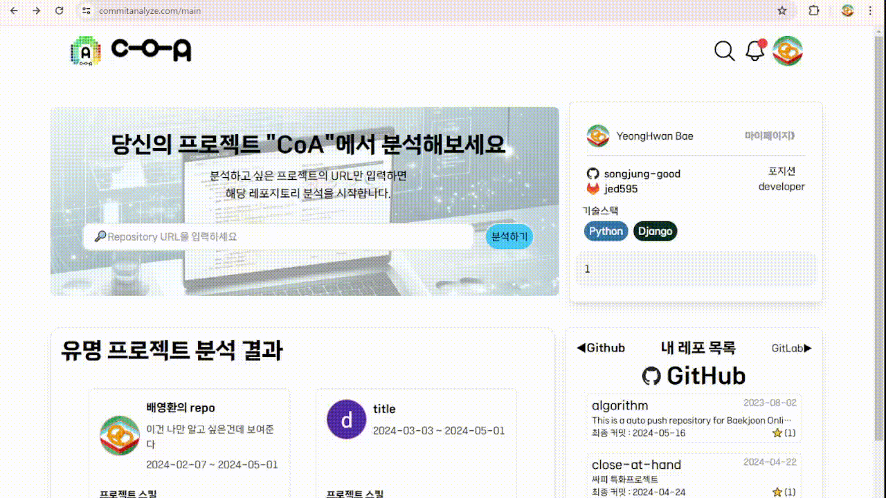
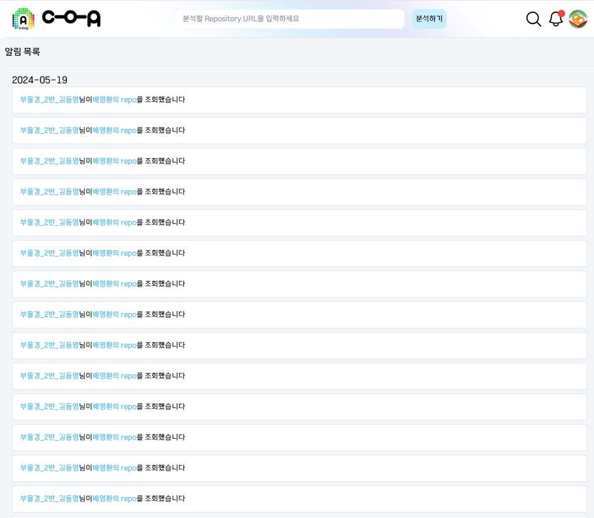
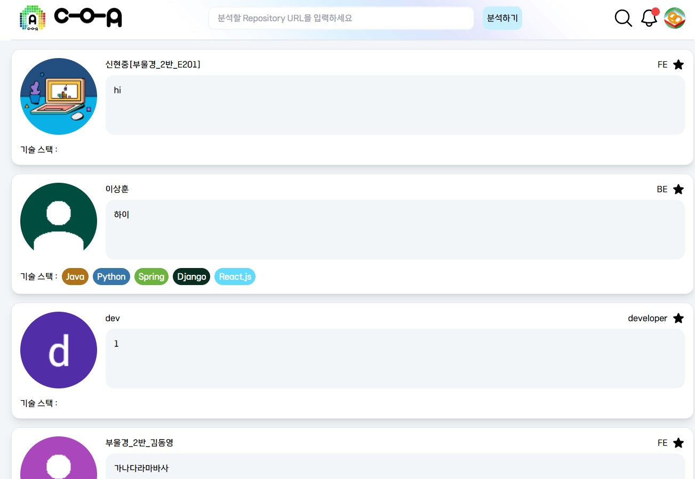
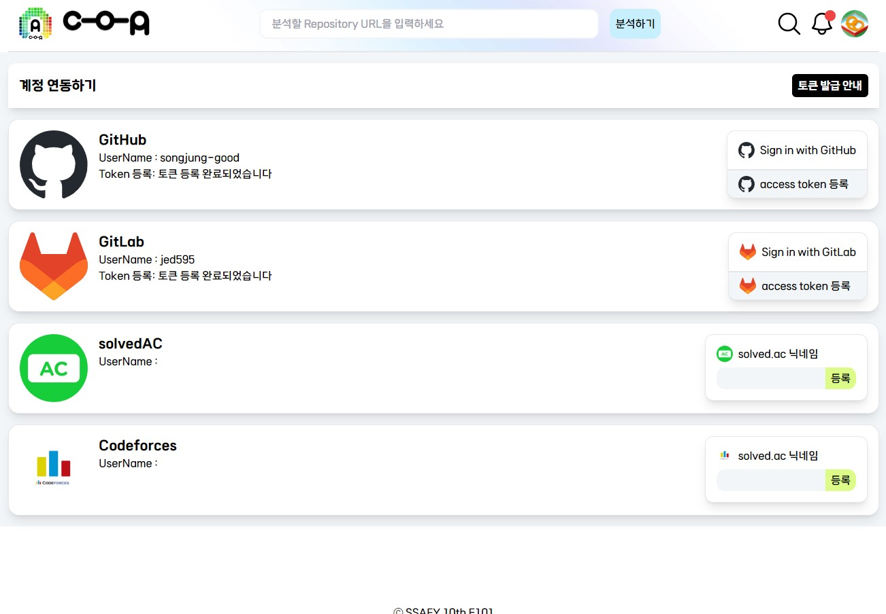
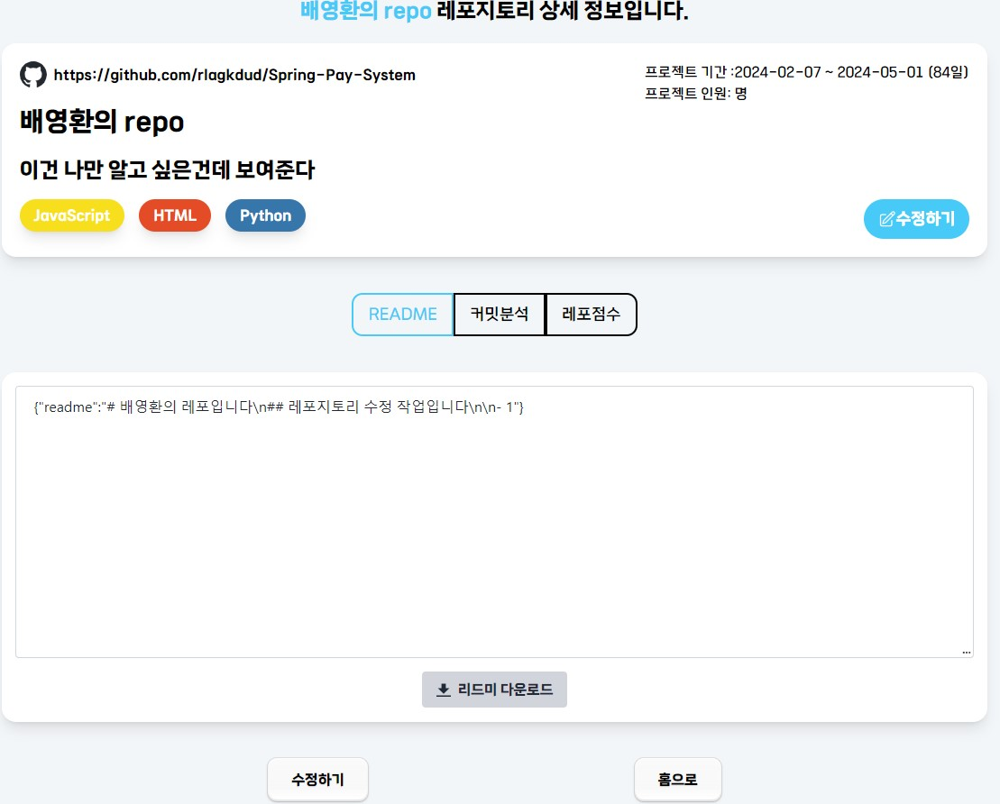
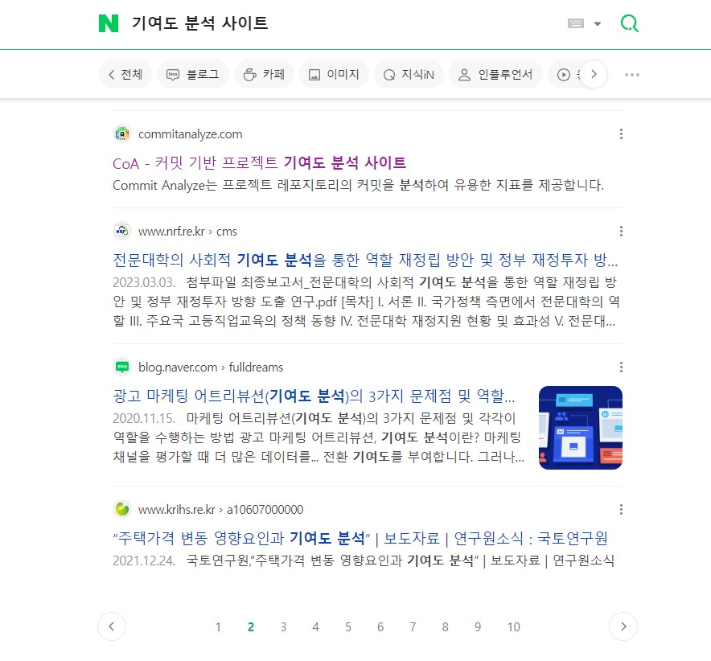
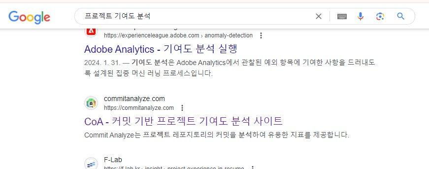

 
# CoA - 커밋 기반 프로젝트 기여도 분석 사이트 

💰 본 프로젝트는 삼성 청년 SW 아카데미 2학기 자율 프로젝트 결과물입니다.

## 프로젝트 소개🌱
1. Readme 자동 생성
- 레포지토리 분석을 통해 전문적인 리드미 초안 자동 생성
- 사용자는 초안을 바탕으로 간편하게 멋진 포트폴리오 완성 가능
#Readme #자동화 #포트폴리오 #이걸로_나도_서류통과

2. 커밋 기반 종합 분석 
- 과거 커밋 분석으로 프로젝트 내 기여 부분 자동 추출
- 코멘트 기능을 통해 강조하고 싶은 부분 직접 지정 가능
#커밋분석 #기능요약 #기술요약 #내가_뭐_했지?  #내가_이런_걸!

3. 코딩 스타일 평가
- 성능, 가독성, 재사용성, 테스트 용이성, 예외처리 능력 종합 평가
- 사용자 개인의 강점과 보완점 파악 용이
#코드평가 #장점 #clean_code #나만의_도우미

4. 개발 통계 제공
- GitHub, GitLab 데이터 통합 분석으로 다양한 통계 제공
- 개발 언어 별 사용자와 레포지토리 수, 기간별 작성 코드 량, 직군 별 평균 점수 등
- 자신의 위치 파악 및 성장 계획 수립에 활용
#JAVA개발자 #JavaScript개발자 #개발자_통계 #나의_위치는?

## UCC

## DEV101

| **이상훈 [BE]**                          | **김하영 [BE]**                     | **구본웅 [AI]**               |
| ---------------------------------------- | -------------------------------------------- | ---------------------------- |
| 보안/ 인증 관리   기획 및 발표    분기의 마술사 | API공장   CI/CD   집 가고 싶어 | 분석기능   AI와의 전쟁   보눙이 |
| **신현중 [FE]**                        | **김동영 [FE]**                       | **배영환 [FE]**                       |
| 통계 & 마이페이지   D3 뿌시기   디자인은 디자이너가 | 랜딩 & 상세페이지   반응형 / 인터렉티브   춘식이 전도사 | 메인 & 검색   컴포넌트 쪼개기   Type만 하루종일 |

## 프로젝트 기간💞️

### 진행기간

- 2024년 4월 8일 ~ 2023년 5월 17일(6주)👋

프로젝트 기획(2주) 프로젝트 개발(3주) 프로젝트 리펙토링 및 발표(1주)

## 개발 환경 👀

    <h1>📚 STACKS</h1>

  

    
    
        
           
  
        
        
    
           
        
        
        
    

           
       
    
      

#### 기술스택(사용목적)

- JavaScript es6++

- Node v20.12.2

- Next 14.2.2

- typescript 5

- zustand 4.5.2

- tailwindcss 3.4.1

- styled-components 6.1.8

- prettier 3.2.5

- d3 7.9.0

- JAVA 17

- SpringBoot 3.2.2

- redis

- JPA

- MySQL

- OAUTH

- Amazon EC2

- Jenkins

- Docker

#### 협업 툴👊

- Notion
- Mattermost
- gitlab
- jira
- google docs
- Figma

## 프로젝트 구조
### ERD 🌐

### 아키텍쳐♟️

### 폴더 구조

## 웹페이지

### 1. 랜딩페이지

​	✔️ 아이디, 비밀번호를 입력 후 회원가입

​	✔️ 중복체크를 통한 ID 검사

​	✔️ JWT를 이용하여 거울과 앱에서 사용자 확인

### 2. 메인페이지

​	✔️ 나의 레포지토리의 프로젝트 확인

​	✔️ URL 입력을 통한 분석기능 

​	✔️ 연동을 통해 나의 정보 확인

### 3. 검색페이지

​	✔️ 분석한 프로젝트 검색과 유저 검색가능

​	✔️ 페이지네이션을 통한 정보 분배

​	✔️ 검색페이지 내에서 즐겨찾기, 페이지 이동 가능

### 4. 알림페이지

​	✔️ 나와 관련된 정보를 확인

​	✔️ 내 프로젝트 방문자, 내 프로필 등록, 분석 완료 등의 알림 제공

### 5. 마이페이지

​	✔️ 프로필, 개요, 연혁, 레포, 심층분석 등의 정보 제공

​	✔️ GitLab, GitHub, Solved.ac 의 데이터 통합

​	✔️ 기간별 자신의 성장 과정을 한눈에 볼 수 있게 데이터시각화

### 6. 팔로우페이지

​	✔️ 내가 팔로우 한 유저의 정보 한눈에 확인 

​	✔️ 해당 유저의 페이지로 이동

### 7. 연동페이지

​	✔️ GitHub, GitLab, Solved.ac 등의 계정을 연동

​	✔️ access Token 발급 과정을 상세 안내

### 8. 프로젝트 상세페이지

​	✔️ Readme, 커밋분석, 레포점수 제공

​	✔️ Readme 수정 및 저장, 다운로드 가능

​	✔️ 커밋 분석에 대한 코멘트 기능

   ✔️ 개인이 확인 가능한 레포 점수를 통해 자신의 부족한 부분 확인 가능

## 결과 및 회고

### 검색포털 등록

|                           | **네이버**                     | **구글**               |
| ---------------------------------------- |  |  |

    - 포털에 등록하여 (뭐라뭐라 할말 적가)

### 사용자 편의성 

    - 분기처리 내용

    - 사용자 편의성 UX/UI 등

### 회고

    - 구본웅

    - 김동영

    - 김하영

    - 배영환 : 
        - 프로젝트를 시작할 때
          - 팀원 중 한 명이 프로젝트를 정리하는게 너무 어렵다고 이런 서비스 어떻냐고 먼저 제안
          - 당시 '이게 완성할 수 있는 프로젝트인가?', '이걸 만들 수 있다고?'라고 생각
          - 이 서비스를 사용해 보니 너무 신기하다. 
          - 스스로 나의 프로젝트/ 나의 코드를 설명하는게 아니라 분석을 통해 얻은 정보여서 생각하지 못한 부분까지 알 수 있게 되어서 보완할 점도 알게 되고,내가 모르던 나의 장점도 알 수 있게 되어서 좋았다.
        - 어려웠던 점        
          - UX를 고려한 UI를 만드는게 제일 어려웠다. 비슷한 사이트가 없어서 이것 저것 섞어서 만들다보니 우리 프로젝트를 사용할 사용자에 알맞은 UI를 정하는 과정이 너무 어려웠다.
          - 지금도 딱 맞는 디자인이라고 생각하지 않아서 사용자 리포트를 통해 수정해나갈 예정

    - 신현중 :

    - 이상훈 :
